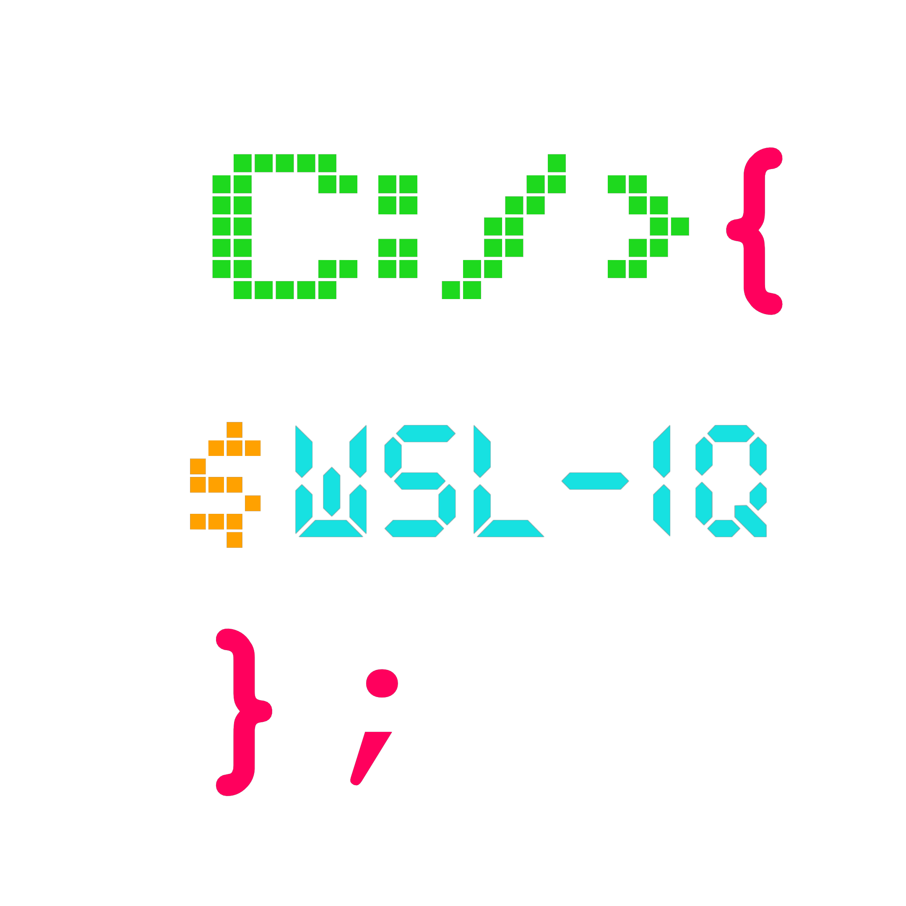
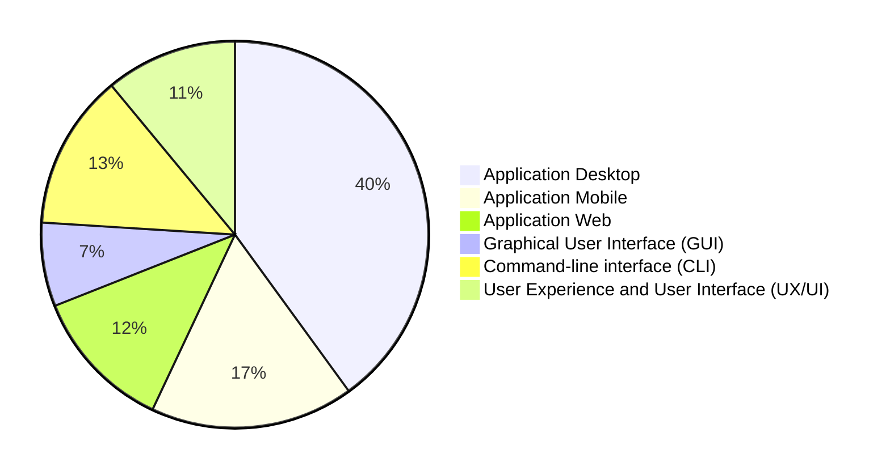
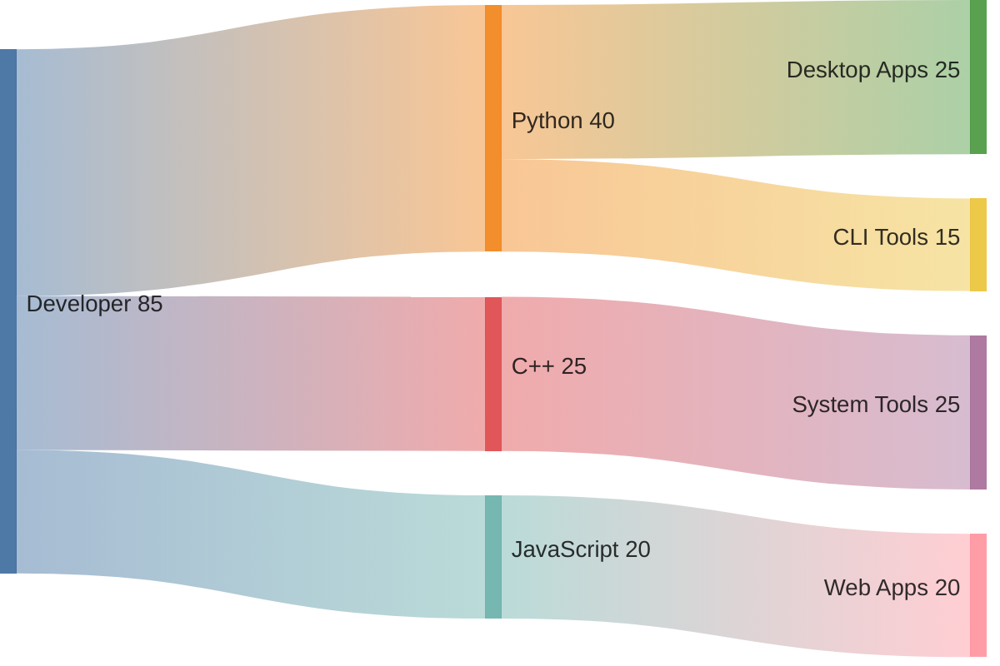

---

---

---

### *My Skills*

---

###  *I work as a freelance software developer specializing in the design and development of I focus on delivering a comprehensive experience that combines simplicity, precision, and high-quality execution.*

---

---

### *GitHub Stats:*
 

  

## Top Languages

  

---
    
---

### *To Contact Me*

